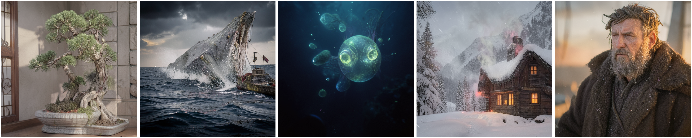

# bonsai-image-android

Running [PrismML's Bonsai Image](https://github.com/PrismML-Eng/Bonsai-Image-Demo)
model – a ternary-quantised FLUX.2 [klein] 4B – on the Hexagon NPU of a 2025
Android flagship. This is the Android counterpart to
[bonsai-image-ios](https://github.com/duration-ai/bonsai-image-ios): the same model and the same quantisation,
both PrismML's, taken down a different silicon path. The diffusion transformer
runs on the Qualcomm Hexagon V79 through QNN; the text encoder and the VAE run on
the CPU. The whole thing renders a 512×512 image on the phone, with no network.

<p align="center">
  
  <br><em>512×512, 4 steps, generated on-device on a Galaxy S25+ (Hexagon V79). Prompts from the iOS sample app, for a like-for-like comparison.</em>
</p>

PrismML ship the model; this repo is the port of their open weights onto the
Qualcomm NPU. Write-up:
[duration.ai/blog/generating-images-with-a-2025-android](https://www.duration.ai/blog/generating-images-with-a-2025-android).

## What it does

The pipeline is three stages, run one after another:

```
prompt ─► Qwen3-4B encode (CPU) ─► Bonsai DiT, 4-step denoise (Hexagon V79 NPU) ─► flux2 VAE decode (CPU) ─► 512×512 image
```

The diffusion transformer is five double-stream blocks
and twenty single-stream blocks; each of those, plus a prologue and an epilogue, is
exported on its own and compiled to a QNN context binary for the V79 – twenty-seven
binaries in all, chained on-device by a small C++ runner that carries the latent, the
RoPE tables and the Euler step between them. The text encode and the VAE decode are handled on the CPU by `sd-cli`,
a build of stable-diffusion.cpp – [Juste-Leo2's fork](https://github.com/Juste-Leo2/stable-diffusion.cpp)
for the 1-bit support, with our small [NPU-split patch](patches/).

## Results

Measured on a Galaxy S25+ (SM-S936B, Snapdragon 8 Elite, Hexagon V79, 12 GB),
512×512, 4 denoise steps (matching the iOS port), the five prompts from the iOS
sample app:

| Prompt | encode (CPU) | DiT (NPU) | decode (CPU) | total |
| --- | --- | --- | --- | --- |
| bonsai tree | 19 s | 62 s | 45 s | 126 s |
| humpback whale | 20 s | 64 s | 42 s | 126 s |
| jellyfish | 20 s | 66 s | 45 s | 131 s |
| mountain cabin | 20 s | 68 s | 47 s | 135 s |
| weathered sailor | 23 s | 67 s | 48 s | 138 s |

The DiT runs at about 16 s per step. Each render was from a cool start (SoC ~45 °C,
on battery).

The five prompts in full, in the order above:

1. A bonsai tree in a quiet ceramic studio, soft morning light, shallow depth of field
2. A massive humpback whale breaching beside a tiny fishing boat, dramatic ocean spray
3. A bioluminescent jellyfish ballet in dark ocean depths, ethereal and otherworldly
4. A cozy mountain cabin in winter storm, smoke from chimney, warm windows, romantic landscape
5. A weathered sailor in oilskin coat, salt spray on his beard, golden hour photography

The same DiT workload on the other two compute units:

| DiT path, 512×512, 4 steps | result |
| --- | --- |
| CPU (Snapdragon 8 Elite) | works – ~114 s per step, so ~8–9 min for a full image |
| GPU (Adreno 830 v2) | partial – OpenCL rendered 256², but no GPU path finished 512² |
| NPU (Hexagon V79) | works – ~16 s per step, ~140 s for a full image |

Only the NPU finishes a 512² render in usable time; the CPU is about an order of
magnitude slower on the transformer. On the GPU, an OpenCL build rendered 256² but
crashed pushing to 512², and the Vulkan path (`sd-cli-vk`) faults on the first
diffusion submit (`vk::DeviceLostError`) at every size, so no GPU path finished a
512² render. Full diagnosis – KGSL counters, the q1_0 + bf16 trigger – is in
[samples/metrics.md](samples/metrics.md).

Peak memory is about 5.0 GB resident, around 4.6 GB of system memory in use at the
peak. That is dominated by the text encoder: the CPU build loads the full 4.2 GB
of weights (3.2 GB encoder, 0.9 GB transformer, 0.1 GB VAE) for each CPU stage.

The deployable bundle is about 10.7 GB:

| Part | Size |
| --- | --- |
| Qwen3-4B encoder (gguf, 4-bit `UD-Q4_K_XL`) | 2.55 GB |
| Bonsai DiT (q1_0 gguf, for the CPU stages) | 0.87 GB |
| flux2 VAE (safetensors) | 0.32 GB |
| 27 DiT context binaries (Hexagon V79) | 6.89 GB |
| sd-cli + QNN runtime + runner | 0.15 GB |

The context binaries dominate the bundle. The DiT is 865 MB as a q1_0 (1-bit) gguf,
but the V79 runs fp16 and int16, not 1-bit, so the weights expand when compiled into
context binaries – the twenty single-stream blocks as fp16, the five double-stream
blocks as int8-weight / int16-activation – so 865 MB becomes 6.9 GB.

## Comparison with the iPhone

The [iOS port](https://github.com/duration-ai/bonsai-image-ios) runs the same model,
the same 512×512 at the same 4 steps, on an iPhone 12 Pro (2020, 6 GB):

| | iPhone 12 Pro (2020) | Galaxy S25+ (2025) |
| --- | --- | --- |
| DiT engine | GPU (MLX) | NPU (Hexagon V79) |
| Time, 512² / 4 steps | ~140 s | ~140 s |
| Peak memory | ~3 GB | ~5 GB |
| Bundle | 3.7 GB | 10.7 GB |

## Layout

```
export/   torch → tflite. The q1_0 weights, re-exported per block at the 512²
          shape. dit_block.py / single_block.py are the block definitions
          (single_block.py is stream-split so each per-token op fits the V79
          VTCM); export_one_q1.py drives one chunk; build_vae_dec.py the VAE.
build/    tflite → QNN V79 context binary. build_fp.sh for the fp16 chunks
          (pro, singles), build_robust_all.sh for the int16 chunks (doubles,
          epilogue) with multi-prompt calibration. rebuild_all_241.sh builds
          all 27 against a given QNN backend.
runner/   qnn_chain512.cpp – the on-device chain. Loads the binaries, carries
          the latent / RoPE / Euler step between them, writes the final latent.
          build.sh cross-compiles it with the NDK.
scripts/  bonsai_render.sh – the three-stage on-device render, end to end.
patches/  npu-split.patch – the sd-cli hooks for the CPU encode / decode stages.
samples/  the images above, and the metrics behind them.
```

The weights, the tflites and the context binaries are not in the repo – they are
large, and the weights are PrismML's to distribute. `build/` and `export/`
reproduce the binaries from the gguf.

## Build it yourself

You need the QNN SDK (QAIRT), an NDK, and a V79 device. In outline:

1. Get the Bonsai q1_0 gguf, the Qwen3-4B gguf and the flux2 VAE.
2. `export/` – re-export each of the 27 blocks to fp32 tflite at the 512² shape.
3. `build/` – compile each tflite to a V79 context binary (`rebuild_all_241.sh`),
   pointing the backend at your QAIRT `libQnnHtp.so`.
4. `runner/build.sh` – cross-compile `qnn_chain512` for arm64.
5. Build `sd-cli` from [Juste-Leo2's stable-diffusion.cpp fork](https://github.com/Juste-Leo2/stable-diffusion.cpp)
   with `patches/npu-split.patch` applied – see [patches/](patches/).
6. Push the binaries, models, runner and the `sd-cli` build to the device, and run
   `scripts/bonsai_render.sh "your prompt" out.png 4`.

The `build/` and `export/` scripts assume a `~/bonsai-export` working directory on
the Linux build box, where the gguf, the QAIRT SDK and the intermediate tflite / QNN
artefacts live. Adjust the paths at the top of each script, or set `BONSAI_GGUF`, if
yours differ.

The model and the quantisation are PrismML's. This repo is the NPU inference port.

## Credits & license

Apache-2.0 (see [LICENSE](LICENSE) and [NOTICE](NOTICE)). The model and its science
are PrismML's, built on FLUX.2 [klein] (Black Forest Labs) and Qwen3 (Alibaba Cloud)
– all Apache-2.0. The CPU text-encode and VAE-decode stages use `sd-cli`, a build of
stable-diffusion.cpp ([leejet](https://github.com/leejet/stable-diffusion.cpp), MIT)
via [Juste-Leo2's 1-bit fork](https://github.com/Juste-Leo2/stable-diffusion.cpp),
with our [NPU-split patch](patches/); the diffusion transformer runs through
Qualcomm's QNN / QAIRT SDK (proprietary, obtained separately). This repository is only the Hexagon-NPU inference port and is not
affiliated with or endorsed by them. *Created using Bonsai Image by PrismML.*
